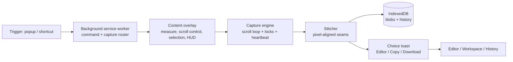

<div align="center">


# ScreenX

**MV3 screenshot extension for Chromium: visible / full-page / selected-area capture, annotation, workspace, and history — 100% local.**

[](https://developer.chrome.com/docs/extensions/develop/migrate/what-is-mv3)
[](https://react.dev)
[](https://www.typescriptlang.org)
[](https://tailwindcss.com)
[](#testing)
[](https://npmjs.com)
[](#license)
[](PRIVACY.md)
[](https://github.com/SUMANTHXT900/SCREENX/releases/latest)

</div>

---

## Quickstart

**No build needed — install from a release:**

1. Download the latest `screenx-v*.zip` from [Releases](https://github.com/SUMANTHXT900/SCREENX/releases/latest) and unzip it anywhere.
2. Open `chrome://extensions` → enable **Developer mode**.
3. **Load unpacked** → select the unzipped folder. Pin ScreenX, reload open tabs once.

**From source (contributors):**

```bash
npm install
npm run build      # typecheck + production build → dist/
```

Then load unpacked in Chrome:

1. Open `chrome://extensions` → enable **Developer mode**
2. **Load unpacked** → select the `dist/` folder
3. Pin ScreenX, reload any open tabs once (content-script protocol check)

> pnpm works too (`pnpm install && pnpm build`), but npm is canonical — CI installs with `npm ci`.

---

## Features

| Feature | What you get |
|---|---|
| Three capture modes | **Visible** viewport, **Full page** (auto-scroll + seam-aligned stitching), **Selected area** (drag a box, extend across scroll) |
| Instant clipboard | Screenshot lands on your clipboard on capture — paste anywhere, no detour |
| Choice toast | In-page card with thumbnail: **Open in Editor**, **Copy**, **Download** |
| Editor | Annotate (shapes, text, crop) and export PNG/JPEG, copy back to clipboard |
| Workspace & History | Every capture persisted to IndexedDB; grouped multi-part pages, activity log (rolling 200) |
| Never silent | Progress HUD, render-confirmed toasts, system-notification fallback when the tab isn't focused |

## Shortcuts

| Action | Shortcut |
|---|---|
| Capture visible area | `Alt` + `Shift` + `S` |
| Capture full page | `Alt` + `Shift` + `F` |
| Capture selected area | `Alt` + `Shift` + `C` |
| Cancel selection | `Esc` |

Remappable at `chrome://extensions/shortcuts`. If a shortcut row appears blank, re-assign it there — Chrome sometimes drops suggested keys on reinstall.

**Flow:** trigger from popup or shortcut (popup closes immediately, capture runs in the background) → watch the **progress HUD** (stay on the tab until it finishes) → image is **auto-copied**, choice toast offers Editor / Copy / Download → everything lands in **Workspace** and **History**.

---

## How it works



- **Capture** (`src/capture/`) — planner (positions, occlusions, timeouts) → engine (scroll loop, locks, heartbeat) → stitcher (pixel-aligned canvas seams, auto-split oversized pages).
- **Content script** (`src/content/`) — classic single-file bundle: measurement, scroll control with settle-then-read, drag-selection overlay, progress HUD, toasts.
- **Messaging** (`src/messaging/`) — versioned typed protocol with stale-tab detection.
- **Storage** (`src/storage/`) — IndexedDB blobs + session-pointer handoff + history log.

---

## Project structure

```
src/
  background/   # service-worker router + handlers (capture, toast, copy, download, notify)
  capture/      # planner, engine (scroll loop/locks/heartbeat), stitcher, clipboard
  content/      # classic content bundle: dom, scroll, selection overlay, HUD, toasts
  messaging/    # versioned typed protocol + client (stale-tab detection)
  storage/      # IndexedDB repos, session handoff pointers, history log, filenames
  popup/        # toolbar popup (triggers capture, closes immediately)
  editor/       # annotation surface (shapes, text, crop) + PNG/JPEG export
  workspace/    # persisted captures, grouped multi-part pages
  history/      # rolling activity log (200 entries, tombstoned deletes)
  state/        # zustand stores (settings, capture status)
  components/   # shared neobrutalist UI primitives
  types/ utils/ # shared types, helpers
tests/          # vitest suites, one file per domain
```

Conventions: `@/*` → `src/*` · every domain has an `index.ts` barrel · `content.js` must stay a classic bundle (no `import` — enforced by build guard + test).

---

## Development

| Script | Command | What it does |
|---|---|---|
| `dev` | `npm run dev` | watch build to `dist/` (vite, development mode) |
| `build` | `npm run build` | `tsc -b && vite build` → production `dist/` |
| `preview` | `npm run preview` | preview the production build locally |
| `typecheck` | `npm run typecheck` | app-only typecheck (`tsconfig.app.json`, no emit) |
| `typecheck:all` | `npm run typecheck:all` | full project typecheck (`tsc -b`) |
| `lint` | `npm run lint` | eslint over the repo |
| `test` | `npm test` | `vitest run` — full suite once |
| `test:watch` | `npm run test:watch` | vitest in watch mode |
| `clean` | `npm run clean` | remove `dist/` |

**Gates (CI, in order):** `npm run typecheck` → `npm test` → `npm run lint` → `npm run build`. Run all four before opening a PR. CI runs on pushes to `main`/`dev` and all pull requests.

### Testing

vitest, **116 tests across 19 files** (`tests/`). Key suites: `modular` (28, stitch/clipboard/selection math), `clipboardTarget` (11), `synthetic` + `contentGuardRegex` (9 each), `activityLog` (8), `editorShapes` + `downloadName` (7 each), `copyAttempt` (5, incl. focus-retry timing), `boxMath` (4).

<details>
<summary>All suites</summary>

`activityLog` · `boxMath` · `clipboardTarget` · `clipboardWrite` · `content-bundle` (classic-bundle guard) · `contentGuardRegex` · `copyAttempt` · `downloadName` · `editorShapes` · `globalLock` · `grouping` · `modular` · `protocol` · `selectionPending` · `sessionLock` · `shapeGuard` · `stitch_math` · `synthetic` · `worker-dynamic-import`

</details>

---

## Privacy

**100% local.** No servers, no accounts, no analytics, no telemetry — screenshots and metadata never leave your device. Full policy: [`PRIVACY.md`](PRIVACY.md) (also linked in the extension footer).

| Permission | Why |
|---|---|
| `activeTab` | Capture the page you invoke ScreenX on; show toasts there |
| `storage` | Persist captures, history, settings, drafts (local + session) |
| `scripting` | Inject the capture/selection overlay content script into the active tab |
| `clipboardWrite` | Auto-copy screenshots to clipboard without a click each time |
| `downloads` | Save screenshots to your downloads folder |
| `notifications` | Fallback announcements when a capture finishes while its tab isn't visible |

No host permissions — ScreenX can't read browsing history or run on pages you never invoke it on.

---

## Troubleshooting

| Symptom | Fix |
|---|---|
| Captures fail on tabs open before install/update | Reload the tab once (content-script protocol check rejects stale tabs) |
| Shortcut row is blank in `chrome://extensions/shortcuts` | Re-assign it manually — Chrome drops suggested keys on reinstall |
| Nothing happens on `chrome://`, Web Store, or other browser pages | Expected — those pages are protected; capture on a normal website |
| Clipboard auto-copy missed / `Win` + `V` shows no image | Clipboard needs a focused `https` page — hit **Copy** in the toast; Windows history sometimes skips images OS-wide, but paste still works |

<details>
<summary>Still stuck?</summary>

1. Reload the tab, retry the capture, watch the progress HUD for the error step.
2. Check Workspace/History — the capture may have persisted even if the toast missed.
3. Open an issue with: Chrome version, capture mode, page type, and HUD/toast behavior.

</details>

---

## Contributing

- Branch from / target **`dev`**; `main` is release-only.
- Run the gates before pushing: `npm run typecheck && npm test && npm run lint && npm run build`.
- Cut releases with a version tag (`git tag v0.1.22 && git push origin v0.1.22`) — CI verifies tag == manifest, runs gates, and publishes the `dist/` zip.
- Keep `content.js` a **classic bundle** — no `import` statements (build guard + `content-bundle` test enforce this).
- Keep captures local-only: no network calls, no new permissions without a `PRIVACY.md` update.

## License

MIT — see [LICENSE](LICENSE).
