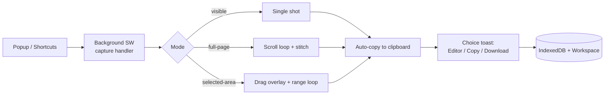

<div align="center">

# ScreenX

**Premium screenshot capture for Chromium — visible, full-page, and cross-scroll selected-area, with a built-in editor, workspace, and history.**

[](https://developer.chrome.com/docs/extensions/develop/migrate/what-is-mv3)
[](https://react.dev)
[](https://www.typescriptlang.org)
[](https://tailwindcss.com)
[](#-development)

</div>

---

## ✨ Features

| | |
|---|---|
| 📸 **Three capture modes** | **Visible** viewport, **Full page** (auto-scroll + seam-aligned stitching), and **Selected area** (drag a box, extend it across scroll) |
| 📋 **Instant clipboard** | Screenshot lands on your clipboard on capture — paste anywhere, no detour |
| 🎛️ **Choice toast** | Glassmorphic in-page card with screenshot thumbnail: **Open in Editor**, **Copy**, **Download** |
| 🖌️ **Editor** | Annotate and export (PNG/JPEG), copy back to clipboard |
| 🗂️ **Workspace & History** | Every capture persisted to IndexedDB; grouped multi-part pages, activity log |
| 🔔 **Never silent** | Progress HUD, render-confirmed toasts, and system-notification fallback when the tab isn't focused |

---

## ⌨️ Usage

| Action | Popup | Shortcut |
|---|---|---|
| Capture visible area | **Visible** | `Alt` + `Shift` + `V` |
| Capture full page | **Full Page** | `Alt` + `Shift` + `F` |
| Capture selected area | **Selected Area** | `Alt` + `Shift` + `S` |

1. Trigger a capture from the popup or a shortcut — the popup closes immediately, capture runs in the background.
2. Watch the **progress HUD** (stay on the tab until it finishes).
3. Image is **auto-copied**; the **choice toast** offers Editor / Copy / Download.
4. Find everything later in **Workspace** and **History**.

> **Notes**
> - `chrome://`, Web Store, and other browser pages are protected — capture on a normal website.
> - Clipboard needs a focused `https` page; if auto-copy misses, tap **Copy** in the toast.
> - Windows Clipboard History (`Win` + `V`) sometimes skips images OS-wide — paste still works everywhere.

---

## 🚀 Quick start

```bash
npm install        # or: pnpm install
npm run build      # typecheck + production build → dist/
```

Load unpacked in Chrome:

1. Open `chrome://extensions` → enable **Developer mode**
2. **Load unpacked** → select the `dist/` folder
3. Pin ScreenX, reload any open tabs once (content-script protocol check)

---

## 🧭 How it works



- **Capture** (`src/capture/`) — planner (positions, occlusions, timeouts) → engine (scroll loop, locks, heartbeat) → stitcher (pixel-aligned canvas seams, auto-split oversized pages).
- **Content script** (`src/content/`) — classic single-file bundle: measurement, scroll control with settle-then-read, drag-selection overlay, progress HUD, toasts.
- **Messaging** (`src/messaging/`) — versioned typed protocol (`CONTENT_PROTOCOL_VERSION`) with stale-tab detection.
- **Storage** (`src/storage/`) — IndexedDB blobs + session-pointer handoff + history log.

---

## 🗂️ Project structure

| Area | Path |
|---|---|
| Capture entry + engines | `src/capture/` (`client/` bridge · `planner/` · `engine/` · `stitch/`) |
| Content script | `src/content/` (`dom/` · `scroll/` · `selection/` · `ui/`) |
| Messaging protocol | `src/messaging/` |
| Storage | `src/storage/` (`idb/` · `handoff/` · `history/`) |
| Background worker | `src/background/` (router + `handlers/`) |
| UI surfaces | `src/popup/` · `src/editor/` · `src/workspace/` · `src/history/` |
| Shared state / types | `src/state/` · `src/types/` |

Conventions: `@/*` → `src/*` · every domain has an `index.ts` barrel · `content.js` must stay a classic bundle (no `import` — enforced by build guard + test).

---

## 🛠️ Development

| Script | What |
|---|---|
| `npm run dev` | watch build to `dist/` |
| `npm run build` | `tsc -b && vite build` |
| `npm run typecheck` | app typecheck |
| `npm run lint` | eslint |
| `npm test` | `vitest run` (planner, stitch math, locks, clipboard, selection) |
